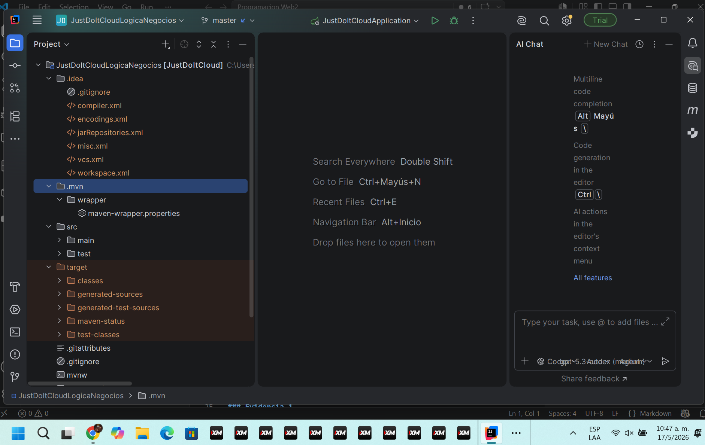
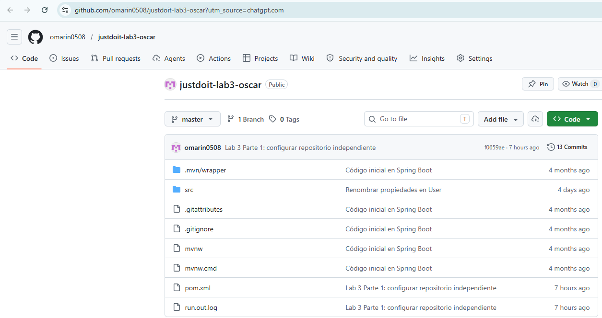
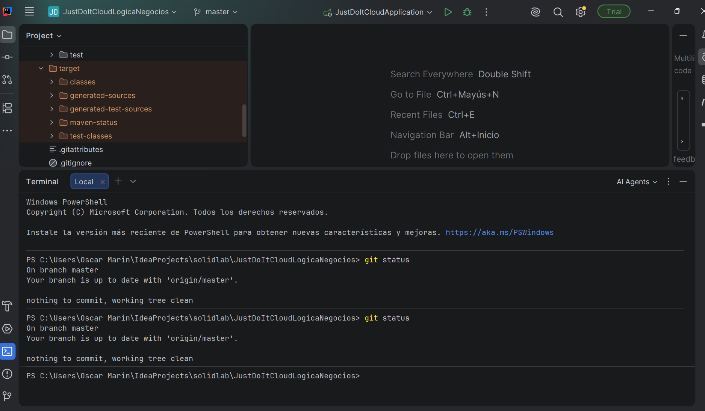
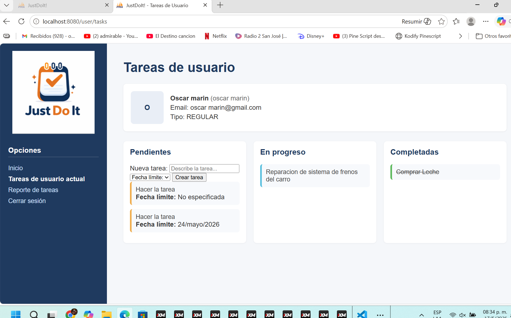
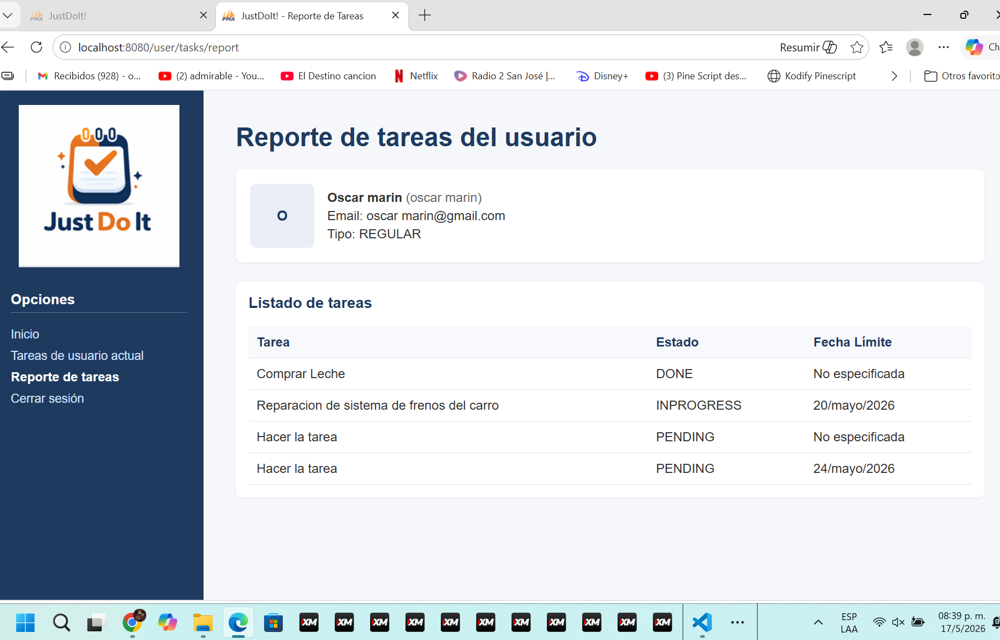

# Laboratorio 3 - Reutilización de plantillas y transición de estados en JustDoIt

## Descripción general

Este laboratorio se desarrolló sobre la aplicación Spring Boot **JustDoIt**, un proyecto existente para la gestión de tareas. A partir de esa base se agregó la funcionalidad **Reporte de tareas del usuario**, que permite visualizar en una tabla las tareas asociadas al usuario actual.

La implementación se realizó respetando la estructura original del proyecto. Se reutilizó el controlador existente, se mantuvo el estilo visual de las plantillas Thymeleaf y se integró la nueva opción dentro de la navegación lateral de la aplicación.

## Objetivo

Crear un repositorio propio para el laboratorio y agregar la funcionalidad **Reporte de tareas del usuario** en la aplicación JustDoIt.

Repositorio propio:

<https://github.com/omarin0508/justdoit-lab3-oscar.git>

## Metodología empleada

El trabajo se realizó de forma incremental, siguiendo la metodología aplicada en el curso **Programación Web II**.

- **IntelliJ IDEA:** se utilizó para abrir, revisar y ejecutar el proyecto Spring Boot.
- **VS Code:** se utilizó para documentar el laboratorio en formato Markdown.
- **Git y GitHub:** se utilizaron para versionar el proyecto y publicar el repositorio propio.
- **Carpeta de evidencias:** se utilizó para almacenar capturas del proceso y de la funcionalidad implementada.
- **Exportación a PDF:** este README queda preparado como base para generar el documento final de entrega.

## Parte 1 - Creación del repositorio propio

### Apertura del proyecto en IntelliJ IDEA

El primer paso fue abrir el proyecto **JustDoIt** en IntelliJ IDEA para revisar su estructura, confirmar que se trataba de una aplicación Spring Boot y ubicar los archivos principales del sistema.



### Creación del repositorio propio en GitHub

Después de revisar el proyecto, se creó un repositorio propio en GitHub para trabajar el laboratorio de forma independiente. También se reemplazó el remote original por el repositorio del estudiante.

Repositorio utilizado:

<https://github.com/omarin0508/justdoit-lab3-oscar.git>



### Push inicial del proyecto

Con el remote actualizado, se realizó el push inicial hacia GitHub. Esto permitió guardar una copia base del proyecto antes de documentar y validar la funcionalidad implementada.



## Parte 2 - Funcionalidad Reporte de tareas

La funcionalidad implementada agrega una nueva ruta dentro del módulo de tareas del usuario:

```text
/user/tasks/report
```

Para mantener la coherencia del proyecto, se reutilizó el controlador existente `UserTasksController.java`. En este controlador se agregó el método `showUserTasksReport`, encargado de preparar la información de tareas y retornar la nueva vista Thymeleaf.

También se creó el fragmento `fragments/user-info.html`, utilizado para reutilizar información del usuario en las vistas. Además, se creó el template `usertasks-report.html`, donde las tareas se presentan en formato tabular.

La navegación lateral se actualizó agregando la opción **Reporte de tareas**, manteniendo el mismo estilo visual del proyecto original.

Elementos principales de la funcionalidad:

- Nueva ruta `/user/tasks/report`.
- Reutilización de `UserTasksController`.
- Creación del fragmento Thymeleaf `user-info.html`.
- Creación del template `usertasks-report.html`.
- Actualización del menú lateral.
- Presentación de tareas en una tabla.

### Vista original de tareas

Antes de revisar el reporte, se validó que la ruta original de tareas del usuario continuara funcionando correctamente.



### Nueva vista de reporte tabular

La nueva vista permite consultar las tareas del usuario en una tabla, facilitando la lectura de la información y manteniendo la apariencia original de JustDoIt.



## Aplicación práctica de Spring MVC en el laboratorio

Spring MVC trabaja con el patrón **Model - View - Controller**. En este laboratorio se observa este patrón porque la aplicación separa los datos, las pantallas y el control de las rutas.

- **Model:** corresponde a los datos de la aplicación, por ejemplo `User` y `Task`.
- **View:** corresponde a las páginas HTML generadas con Thymeleaf.
- **Controller:** recibe las solicitudes del navegador y decide qué debe hacer la aplicación.

En JustDoIt, los controladores funcionan como intermediarios entre la interfaz web, la lógica de negocio y las acciones que ejecuta el sistema. Cuando el usuario entra a una ruta, el controlador recibe la solicitud HTTP, procesa la información necesaria, llama a servicios como `TaskService` y devuelve una vista HTML.

Para este laboratorio se reutilizó el controlador `UserTasksController`, ya que la nueva funcionalidad pertenece al mismo módulo de tareas del usuario. No se creó un controlador adicional porque no era necesario para la arquitectura del proyecto.

Fragmento del controlador utilizado:

```java
@Controller
@RequestMapping("/user/tasks")
@SessionAttributes("user")
public class UserTasksController
```

Este controlador administra la ruta principal de tareas y la nueva ruta del reporte:

```text
/user/tasks
/user/tasks/report
```

La nueva ruta del reporte se definió con `@GetMapping`, porque se utiliza para consultar y mostrar información:

```java
@GetMapping("/report")
```

Después de preparar los datos del usuario y consultar las tareas mediante `TaskService`, el método retorna el nombre de la vista Thymeleaf:

```java
return "usertasks-report";
```

Ese retorno hace referencia al archivo:

```text
src/main/resources/templates/usertasks-report.html
```

Con esto se mantiene el flujo MVC: el controlador recibe la solicitud, el servicio entrega los datos, el modelo los pasa a la vista y Thymeleaf genera la página final del reporte.

## Funciones, métodos y anotaciones Spring utilizadas

En la implementación se utilizaron varias anotaciones y elementos propios de Spring MVC. A continuación se resumen con el uso que tienen dentro del laboratorio:

| Elemento | Uso dentro del laboratorio |
| --- | --- |
| `@Controller` | Marca `UserTasksController` como una clase que atiende solicitudes web. |
| `@RequestMapping("/user/tasks")` | Define la ruta base del módulo de tareas del usuario. |
| `@GetMapping` | Atiende solicitudes GET, usadas para abrir páginas o consultar información. |
| `@GetMapping("/report")` | Define la ruta específica del reporte de tareas. |
| `@PostMapping` | Atiende solicitudes POST, usadas cuando el usuario envía datos al servidor. |
| `@ModelAttribute("user")` | Permite trabajar con el usuario actual dentro del controlador y las vistas. |
| `@SessionAttributes("user")` | Mantiene el usuario disponible durante la sesión. |
| `Model` | Sirve para enviar datos desde el controlador hacia Thymeleaf. |
| `TaskService` | Se utiliza para consultar las tareas sin colocar esa lógica directamente en el controlador. |
| Retorno de vistas | Devuelve nombres de templates, como `usertasks-report`, para que Thymeleaf genere el HTML final. |

Con estas herramientas, el controlador no se encarga de todo por sí solo. Su función es coordinar: recibe la solicitud, pide la información necesaria al servicio, coloca los datos en el modelo y retorna la vista que debe mostrarse.

## Relación con la arquitectura actual

La funcionalidad se integró dentro de la arquitectura que ya tenía JustDoIt. Se mantuvieron las mismas entidades, vistas Thymeleaf, servicios y controladores del proyecto base.

No se creó una arquitectura nueva ni se cambió el enfoque general del sistema. La idea fue agregar el reporte de tareas respetando la organización existente, los nombres de archivos, el flujo de trabajo y el estilo visual original.

## Archivos modificados

Los archivos relacionados con la implementación del laboratorio son:

- `pom.xml`
- `src/main/java/teccr/justdoitcloud/controller/UserTasksController.java`
- `src/main/resources/templates/userhome.html`
- `src/main/resources/templates/usertasks.html`
- `src/main/resources/templates/usertasks-report.html`
- `src/main/resources/templates/fragments/user-info.html`
- `src/main/resources/static/css/styles.css`

## Validación

La implementación fue validada localmente mediante compilación y ejecución del proyecto.

Comando de compilación:

```powershell
.\mvnw.cmd -DskipTests compile
```

Resultado obtenido:

```text
BUILD SUCCESS
```

Comando para levantar la aplicación:

```powershell
.\mvnw.cmd spring-boot:run
```

Puerto utilizado:

```text
localhost:8080
```

Rutas probadas:

- `http://localhost:8080/user/tasks`
- `http://localhost:8080/user/tasks/report`

## Conclusión

El objetivo del laboratorio se cumplió al crear un repositorio propio y agregar la funcionalidad **Reporte de tareas del usuario** dentro de JustDoIt. La solución reutiliza componentes existentes, conserva el patrón MVC, integra un fragmento Thymeleaf y presenta las tareas del usuario en una vista tabular.

La implementación mantiene el estilo visual original del proyecto y deja la documentación preparada para su posterior exportación a PDF.
